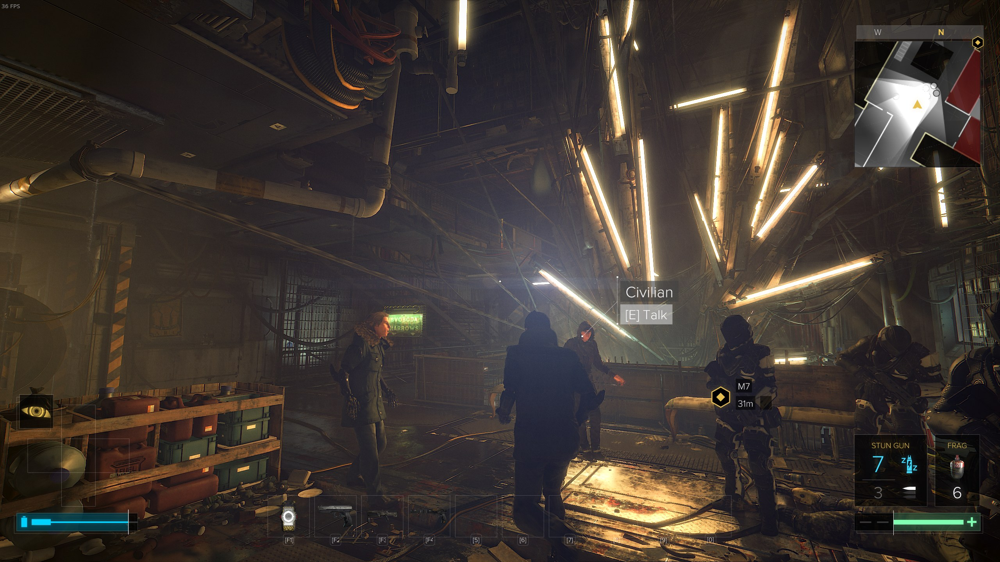
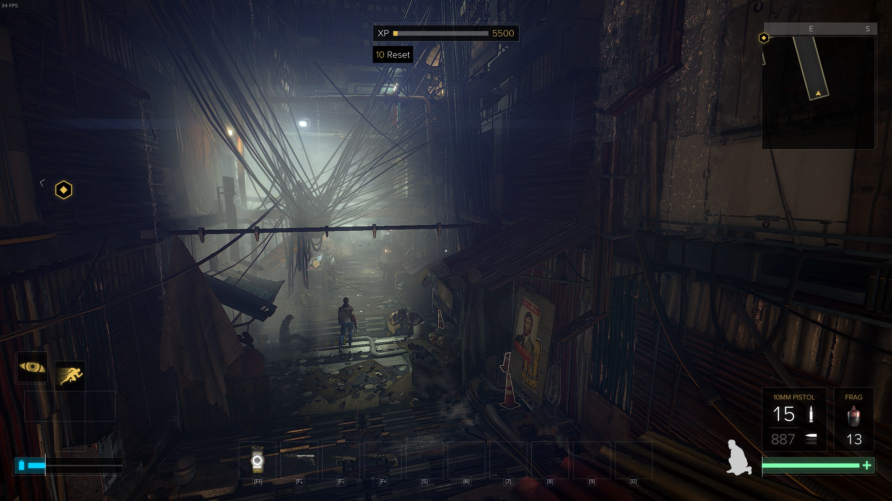
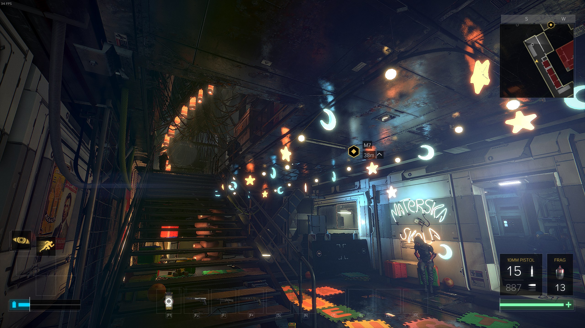

I like games that give me tools and let me decide how to use them. Games with emergent, interconnected systems that reward exploration and experimentation. Games that blend the static and scripted with the systemic and emergent such that the world feels reactive and alive with possibilities. Games where everything you do is a choice.

Deux Ex games take these mechanics and intertwine them with narratives of espionage and global conspiracy, filled with major and minor characters with diverse motivations, goals and loyalties, and leave you free to find your own place and role in their world.

Mankind Divided is the most successful game at doing all of that since the original Deus Ex.

<!--more-->

Human Revolution, until the final catastrophe, presented a world full of hope for the bourgeoning possibilities of augmentation and self-directed evolution. Inequality was present but treated as a fixable problem by the game's more thinky characters. The general spirit was one of optimism and of being on the brink of a new Renaissance — a period the game's aesthetic design pillaged expertly.

Mankind Divided is a distinctly post-catastrophe world where Augs (augmented humans) are, due to distrust and fear (and the usual opportunism), treated very much as second-class citizens, if citizens at all — routinely brutalised by the police and other citizens, segregated and even shipped off to what are internment camps in all but name.

The Renaissance design influences are gone — no more ruffed collars, sadly — and replaced with a far more run-down, dirty aesthetic where environments feel quite brutalist with their rectilinear forms and big, chunky, square columns — reminiscent of the low poly, shiny-floored solidity of interiors in the original game. The architecture and urban spaces no longer speak of the hope of a bright future, now they dominate with austere oppressiveness.

While the game's chosen aesthetic is less inherently *pretty* than that of Human Revolution, the designers have done, if anything, an even better job of creating a beautiful, if stark, world. Even in some of the ugliest areas of the game — the Aug ghetto you visit, for example — the game's environments are often stunning. Whether in the beautiful chaos of the tangled wires the world relies on for its information feeds or places where humans have tried to beautify their drab surroundings with light and colour, the game often stuns with its attention to the mise-en-scène.

Mankind Divided tells a smaller story than any of the previous titles, focussing on a world very much going to shit. For people like me who love the original game this is *exciting*; we get to see the unfolding of events which will, eventually (hopefully in a later game), lead to Silhouette's bombing of the Statue of Liberty and the founding of UNATCO. We also get to see big names we recognise from Deus Ex vying for position and orchestrating and reacting to events.

The game only has one hub — something which has been criticised but, to my mind, perfectly suits the purpose and character of the game. The enshittening of the world is told through the eyes of the city of Prague and its people. There are, of course, missions to other locations, but it's Prague to which we keep returning and through which we witness rising tensions between Augs and 'Naturals' and the increasing hostility and, later, brutality of the police. Prague serves as focus and flashpoint for events of global significance. It's a portrait of a world falling apart with Prague as the canvas.

The way XP is distributed has been rebalanced since Human Revolution which is a change for the better — it was the wrong way to be opinionated about player choices in a Deus Ex game. Weapons now seem less powerful, at least early on, which is a much better means of nudging players towards a more stealthy, less violent approach. Similarly, hacking tasks now reward more fairly based on goals rather than methods — you get XP regardless of whether you hacked a thing or found the code in the world. There are also *far* fewer unimportant computers to hack which is a blessing for those of us who find XP hard to ignore. 

Unfortunately, the hacking mini-game still exists. It's a fine game in and of itself; just a very different activity to the rest of the game, which breaks immersion and the natural rhythm of fun infiltration action and exploration. It's also irritatingly luck-based. The hacking in the original Deus Ex, which was just a progress bar, may not have been interactive, but waiting for the hacking bar to fill up created time pressure and tension without taking the player *out* of the game they were enjoying. It's not a big deal, I just wish the devs had found a cleverer way to keep hacking active without breaking the game's flow.

Level design is improved since Human Revolution with explorable spaces feeling simultaneously more natural and more labyrinthine. Finding alternate routes feels like a logical process rather than merely stumbling on Route B. Back doors *feel* like *back doors* rather than just... *other* doors, as they sometimes did in the previous game.

Infiltration is, of course, the meat of the game and the area where player choice has the most immediate impact. A stealthy, pacifistic run feels very different from an all-guns-blazing approach, which feels different again from taking everyone down without being seen. I took the latter approach during my first play-through, playing quite carefully and thoroughly, treating levels like real-time puzzle games as I worked out how to use my various tools to get *everyone* without ever being seen. I'm now playing new game plus mode (you keep your augmentations and gear) in a far more gung-ho fashion and it feels very different — the approach you take completely changes the function of the environments you're navigating and thus how they feel as levels. Despite the thoroughness of my first play-through I'm finding plenty I missed including at least one major side-quest line.

A welcome change over Human Revolution is the return of having to choose between augmentations. Early in the game Adam discovers that alongside his regular, Sarif-supplied augmentations he seems to have a raft of super secret extra mega cool augmentations from a mystery source. Activating these augs, however, requires the de-activation of a regular augmentation, for at least some of the game. I wish that it were for all of the game — choice is key to Deus Ex and being forced to make difficult strategic choices between augmentations adds weight and tactical depth.

Side-quests and main quests interweave more closely than they did in Human Revolution with core narrative content often being found in the side-missions. There's also *far* more contextual narrative in the various books, magazines, newspapers, data pads and emails than in any of the previous games, much of it providing a tantalising look into the shaping of the J.C. Denton era world. For people who've played the original game there's a wealth of rewarding reading in Mankind Divided. 

Side-quest givers and other named NPCs now seem more situated in their place and circumstances. I really got a sense that these are people — from activists to police officers to Aug refugees and Naturals — each trying to survive in a world on the brink of collapse. Some give in to the anti-aug sentiment gleefully, others reluctantly. Some resist, others give up. Some try to profit from the misery while others attempt to cling to their morality. The array of reactions each feel real, personal and specific to that person's circumstances and story and reflect the changes they see in the world around them as time passes in the game (spoiler: shit gets worse).

While it still has the bombastic conspiracy stuff we know and love Deus Ex for, Mankind Divided finds a space in its world to tell very human stories that I found quite affecting. 

Side-quests are as diverse as the people giving them — work for a mob boss, find a serial killer, help a couple of refugees acquire fake documents, reacquaint with old artificial friends — and all help tell the story of a world undergoing profound change and the people trying to cope with that change. More successfully than in any other Deus Ex game, you get to see the *effects* of the world-shaking events within which Jensen is enmeshed.

While a smaller, more focussed story than its predecessor, Mankind Divided is a *big* game. My first (careful) play-through took 60 hours and I'm already deep into my second. The focus on Prague allows the game to illustrate the changes happening to the world — the sense of something pent-up and about to burst. The anger and fear and the humane and inhumane reactions of characters both noble and base. A world about to explode seen through the experiences of one city with Adam as witness both to great events and the lives those events touch.

It's the Deus Ex we all love — breaking into things and sneaking around and knocking people out and hacking all their secrets — but it feels like a more emotionally rich and *grown up* game than Deus Ex has managed before.

**One caveat**: This is a *demanding* game. Playing on very high settings I got about 30-50 fps in most areas with my recent i7 and GTX 1070. I hear from my filthy Windows-using friends that it's about the same on their stupid OS.

**Another caveat**: The game got some poor reviews, especially community reviews, on release because of its *stupid* micro-transactions. That stuff is all either rectified or ignorable. I've played a *lot* of this game and never felt affected by it.

If you've got the PC to run it I'd *strongly* recommend Deus Ex: Mankind Divided, especially to fans of the series.

Deus Ex: Mankind Divided is available on [Steam](http://store.steampowered.com/app/337000/Deus_Ex_Mankind_Divided/) and [Humble](https://www.humblebundle.com/store/deus-ex-mankind-divided).

<iframe class="video" src="https://www.youtube.com/embed/09vVF-Hvykg" frameborder="0" allowfullscreen></iframe>

